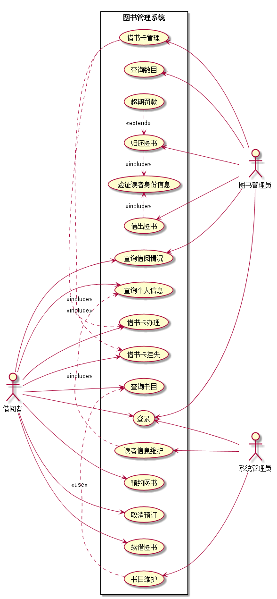
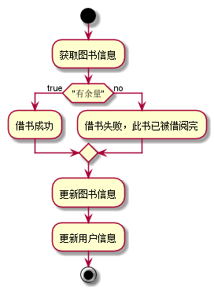
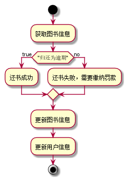
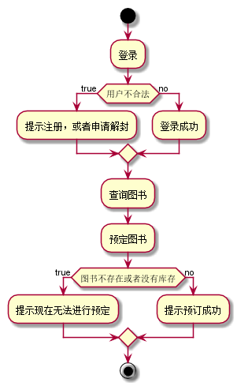
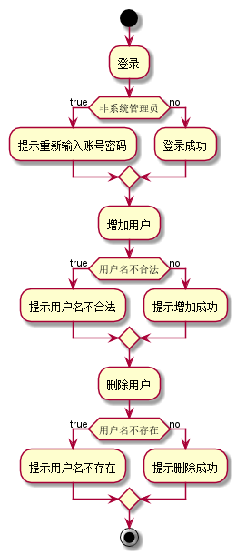

# 实验二：图书管理系统用例建模
<table>
<tr>
<td>学号</td>
<td>班级</td>
<td>姓名</td>
<td>照片</td>
</tr>
<tr>
<td>201510414324</td>
<td>2015级软件工程三班</td>
<td>余行</td>
<td></td>
</tr>
</table>

## 1.图书管理系统的用例关系图
### 1.1用例图PlantUML源码如下：
    
    @startuml

    left to right direction
    :借阅者: as User
    :图书管理员: as Admin
    :系统管理员: as Libraryer

    rectangle 图书管理系统 {
    User ---> (登录)
    User ---> (查询借阅情况)
    User ---> (预约图书)
    User ---> (取消预订)
    User ---> (续借图书)
    User ---> (查询书目)
    User ---> (借书卡办理)
    User ---> (借书卡挂失)
    User ---> (查询个人信息)
    (借出图书).>(验证读者身份信息):<<include>>
    (借出图书) <- Admin
    (查询借阅情况) <- Admin
    (验证读者身份信息)<.(归还图书):<<include>>
    (归还图书)<.(超期罚款):<<extend>>
    (归还图书) <- Admin
    (读者信息维护) <- Libraryer
    (查询个人信息)<.(读者信息维护):<<include>>
    (借书卡管理) <- Admin
    (借书卡办理)<.(借书卡管理):<<include>>
    (借书卡挂失)<.(借书卡管理):<<include>>
    (登录)<--- Admin
    (登录)<-- Libraryer
    (查询数目)<-- Admin
    (书目维护) <--- Libraryer
    (查询书目)<.(书目维护):<<use>>
    }

    @enduml
### 1.2用例图如下：

## 2.参与者说明
### 2.1 系统管理员
主要职责是：系统管理员登陆后，可对借阅者信息进行维护和数目进行维护，定期维护有利于整个系统的流畅和稳定。
### 2.2 图书管理员
主要职责是：对读者的借书、还书等操作进行处理,也可以对图书进行相应的操作，查看图书的借阅情况，对读者进行定时期的信息维护，借阅者也可在此办理或退订自己的借阅卡，管理员还要定时的更新相应的数目信息等。
### 2.3 借阅者
主要职责是：可以通过查询图书并借取或者归还图书，也可查询自己的借阅情况和个人信息。可通过管理员办理借阅卡，若借记卡不慎丢失，可进行挂失并找管理员进行补卡操作。
## 3.用例规约表
### 3.1 "借出图书"用例
| | |
|:------:|:------:|
|用例名称|借出图书|  
|参与者|图书管理员（主要参与者）、借阅者（次要参与者）|
|前置条件|图书管理员已被识别和授权|
|后置条件|存储借书记录，更新库存数据，所借图书状态为借出|
|主事件流|1.图书管理员将读者借书卡提供给系统；2.系统验证读者身份和借书条件；3.图书管理员将读者所借图书输入系统；4.系统记录借书信息，并且修改图书的状态和此书的可借数量；5系统累加读者的借书数量；6.重复3~5，直到图书管理员确认全部图书登记完毕；7.系统打印借书清单，交易成功完成|
|备注|图书馆开架借阅，读者可到管理员处办理借阅卡，找到书后办理借阅手续，因此借书不需要验证库存，而且每本书都是可识别的|
### 借出图书用例流程图源码如下：
    @startuml
    start
    :获取图书信息;
    if ("有余量") then (true)
        :借书成功;
    else (no)
    :借书失败，此书已被借阅完;
    endif
    :更新图书信息;
    :更新用户信息;
    stop
    @enduml

### 3.2 "归还图书"用例
| | |
|:------:|:------:|
 |用例名称|归还图书|  
 |参与者|图书管理员（主要参与者）、借阅者（次要参与者）|
 |前置条件|图书管理员已被识别和授权|
 |后置条件|存储还书记录，更新库存数据，所借图书状态为未借出|
 |主事件流|1.图书管理员将读者借书卡提供给系统；2.系统验证读者身份和还书条件；3.图书管理员将读者所借图书输入系统；4.由系统计算出图书所借日期是否逾期，若逾期则需要借阅者缴纳逾期罚款 5.系统记录还书信息，并且修改图书的状态和此书的可借数量；6.系统打印还书清单，交易成功完成|
 |备注|借阅者可到管理员处还书，出示相应的借阅证，管理员便可帮借阅者归还该图书，若逾期不归还，管理员有权利按照规定罚款，严重者取消借阅资格|
### 归还图书用例流程图源码如下：
    @startuml
    start
    :获取图书信息;
    if ("归还为逾期") then (true)
        :还书成功;
        else (no)
        :还书失败，需要缴纳罚款;
        endif
    :更新图书信息;
    :更新用户信息;
    stop
    @enduml
### 3.3 "预定图书"用例
| | |
|:------:|:------:|
 |用例名称|预定图书|
 |参与者|借阅者|
 |前置条件|图书管理系统有预定功能|
 |后置条件|图书充足|
 |主事件流|1. 登录查询图书2.反馈相应图书信息3.显示图书借阅情况4.返回图书库存 5.订阅相应图书6.向管理员发出请求7.管理员进行进行预定操作8.等待并获取图书|
 |备注|1. 同一类型图书，有多本，应该有详细的信息记录2. 一次借阅最长时间为一周，逾期将会计算罚款|
### 预定图书用例流程图源码如下：
    @startuml
    start
    :登录;
    if (用户不合法) then (true)
        :提示注册，或者申请解封;
        else (no)
        :登录成功;
        endif;
    :查询图书;
    :预定图书;
    if(图书不存在或者没有库存) then (true)
        :提示现在无法进行预定;
        else (no)
        :提示预订成功;
        endif
    stop
    @enduml
### 3.4 "用户管理"用例
| | |
|:------:|:------:|
 |用例名称|用户管理|
 |参与者|系统管理员|
 |前置条件|图书管理系统数据正常|
 |后置条件|更新图书管理系统|
 |主事件流|1.系统管理员身份登录 2.进入系统管理员界面3.进入用户管理界面4.执行用户增删操作5.对用户执行相应操作6.返回执行结果|
 |备注|1.每个操作都有相应提示2.每次操作系统都有相应备份|
### 用户管理用例流程图源码如下：
    @startuml
    start
    :登录;
    if (非系统管理员) then (true)
        :提示重新输入账号密码;
     else (no)
        :登录成功;
     endif;
    :增加用户;
    if(用户名不合法) then (true)
        :提示用户名不合法;
        else (no)
        :提示增加成功;
        endif
    :删除用户;
    if(用户名不存在) then (true)
        :提示用户名不存在;
        else (no)
        :提示删除成功;
        endif
    stop
    @enduml